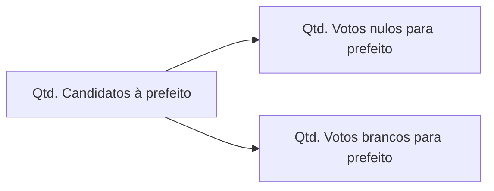
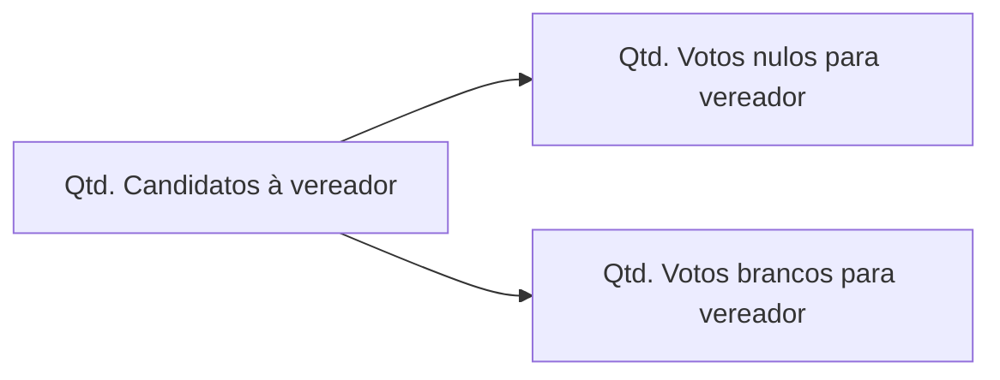

Neste projeto, adentrei nas Eleições de 2024 no Brasil, utilizando dados extraídos do [🔗Portal de Dados Abertos](https://dadosabertos.tse.jus.br/no/dataset/resultados-2024) e projetando um dashboard no Power BI, com apoio da ferramenta Figma para criar uma interface amigável e moderna. Minha intenção era proporcionar uma experiência não só interativa mas também informativa, criando um relátorio que se assemelha a um panfleto, permitindo ao usuário navegar por dados eleitorais em diferentes dimensões, como regiões, partidos e turnos.

<iframe title="Eleições 2024" width="100%" height="486" src="https://app.powerbi.com/view?r=eyJrIjoiMWNhMjU4YTItZjhiYy00MGY5LTkxMWMtZjBkNmVhODkyNmY2IiwidCI6ImM1MjAzYWNlLTdhN2MtNGM4Ni1iMjRkLTNiYmUyOTQ5NTkzYSJ9" frameborder="0" allowFullScreen="true"></iframe>

>Para uma melhor experiência utilize a tela cheia
{: .prompt-warning }
---
## 📄 Bases utilizadas

Todas as bases utilizadas são públicas e disponibilizadas pelo STF via Portal de Dados Abertos. Os seguintes datasets foram utilizados:

◼**Votação nominal por município e zona:** 

| Info     | Descrição                                                                                                                                       |
| -------- | ----------------------------------------------------------------------------------------------------------------------------------------------- |
| Criado   | 09/10/2024                                                                                                                                      |
| Formato  | .csv                                                                                                                                            |
| Tipo     | .zip                                                                                                                                            |
| Download | [🔗Link Download](https://cdn.tse.jus.br/estatistica/sead/odsele/votacao_candidato_munzona/votacao_candidato_munzona_2024.zip)                   |
| Conteúdo | Contém informações detalhadas sobre as eleições de 2024 no Brasil, com todos os Estados, Município, Zonas, Cargos, Partidos, Candidatos e Votos |

◼**Detalhe de apuração por município e zona:** 

| Info     | Descrição                                                                                                                                                        |
| -------- | ---------------------------------------------------------------------------------------------------------------------------------------------------------------- |
| Criado   | 09/10/2024                                                                                                                                                       |
| Formato  | .csv                                                                                                                                                             |
| Tipo     | .zip                                                                                                                                                             |
| Download | [🔗Link Download](https://cdn.tse.jus.br/estatistica/sead/odsele/detalhe_votacao_munzona/detalhe_votacao_munzona_2024.zip)                                        |
| Conteúdo | Contém informações detalhadas sobre as eleições de 2024 no Brasil separados por Estado, Município, Zona Eleitoral, Abstenções e Votos (Válidos, Nulos e Brancos) |

---
## 💡 Visão Geral

A estrutura do dashboard foi concebida para lembrar um panfleto interativo, permitindo que o público tenha acesso rápido e direto às principais informações eleitorais. Contendo as seguintes informações:

**KPI 1:**

>15.034 candidatos a prefeitura disputaram por 5.569 vagas em todo o Brasil.
{: .prompt-tip }

**KPI 2:**

>409.909 candidatos a prefeitura disputaram por 58.400 vagas em todo o Brasil.
{: .prompt-tip }

**Mapa 1:**
Informações sobre votos válidos, nulos e brancos por estado.

>51 municípios do Brasil tiveram segundo turno, sendo 15 capitais.
{: .prompt-tip }

**Barra 1:**
Informações sobre quantidade de prefeitos eleitos por partido.

>O partido com mais prefeitos eleito foi o PSD (Partido Social Democrático) com 875 eleitos no primeiro turno e 9 no segundo turno.
{: .prompt-tip }

**Barra 2:**
Informações sobre quantidade de abstenções por estado.

>Em 2024 tivemos o maior número de abstenções, votos nulos e brancos de toda a história eleitoral do Brasil, só São Paulo teve um total de 4.904.304 abstenções apenas no primeiro turno.
{: .prompt-tip }

---
## Conclusão

Ao transformar os datasets eleitorais brutos em visuais, procurei não apenas informar, mas engajar o usuário, facilitando a exploração das tendências e resultados pertinentes que marcaram o cenário político deste ano. Neste dashboard ainda existe muito espaço para crescimento e melhoraria, pois existem diversos datasets disponibilizados no portal do TSE que não foram utilizados na criação do mesmo. 

