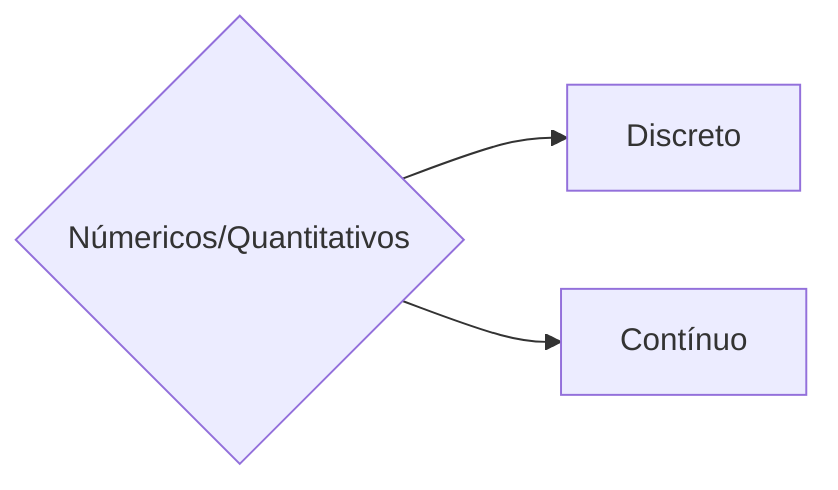
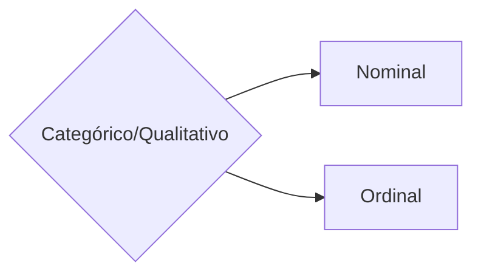

Vivemos na era dos dados. Eles estão em todos os lugares, moldando decisões, alimentando tecnologias inovadoras e direcionando o futuro de organizações e indivíduos. Contudo, para extrair valor real dessa riqueza de informações, é fundamental compreender os conceitos básicos que fundamentam a ciência de dados e a análise de informações.

Este post explora os conceitos iniciais essenciais sobre dados, começando pela distinção entre os principais tipos de dados: estruturados e não estruturados. Além disso, abordaremos as terminologias mais comuns e discutiremos os tipos de atributos e dados, como os numéricos e categóricos, destacando suas características e aplicações. Essa base conceitual é o primeiro passo para transformar dados brutos em artefatos significativos, seja você um iniciante curioso ou um profissional buscando fortalecer suas habilidades.

## Tipos de dados

_Tipos de dados - Estruturados/Semiestruturados/Não estruturados_

Os dados coletáveis podem ser classificados em duas categorias principais: **dados estruturados** e dados **não estruturados**.

### Dados Estruturados

Os dados estruturados são organizados de forma sistemática e seguem um modelo ou estrutura predefinida, encaixando-se perfeitamente em tabelas de dados. Eles incluem tipos discretos de informações, como números, textos curtos e datas, que podem ser facilmente organizados em um sistema bidimensional como linhas e colunas. Esse formato facilita consultas, análises e processamento com ferramentas específicas, como bancos de dados relacionais e planilhas no excel.

_Tipos de dados - Estruturados_

Os arquivos de **dados estruturados** podem ser de diversos tipos, como:
* Arquivos EXCEL.
* Arquivos CSV.
* Arquivos ODS (OpenDocument Spreadsheet Document).
* Banco de dados SQL.
* Arquivos XML.
* Arquivos JSON.

Os dados estruturados são normalmente armazenados em bancos de dados relacionais, banco de dados de grafos, banco de dados espaciais, cubos OLAP e outros.

#### Vantagens do dado estruturado

O uso de dados estruturados apresenta diversas vantagens que os tornam essenciais em muitas aplicações de negócios e análises. Sendo os principais benefícios.

◼**Facilidade de armazenamento e acesso 📖**: Os dados estruturados são armazenados em formatos padronizados, como tabelas relacionais, o que facilita sua organização e consulta. E ferramentas já consolidadas como Sistemas de Gerenciamento de Banco de Dados (SGBD), ferramentas de Business Intelligence (BI), APIs e Sistemas Legados permitem acesso rápido e eficiente aos dados.

◼**Velocidade e eficiência nas análises 🚀**: A estrutura mais bem definida dos dados reduz a necessidade de processamento adicional e tecnicas de modelagem e análise tradicionais como agregação, filtro e cálculos podem ser aplicadas, permitindo análises mais rápidas e eficientes.

◼**Precisão, consistência 🎯**: Com cada campo de dados seguindo um formato predefinido (números, textos ou datas) garantindo assim a consistência entre registros e com isso minimizando erros, facilitando a validação e melhorando a qualidade dos dados.

◼**Escalabilidade 📈**: Os dados estruturados escalam de forma algorítmica. À medida que o volume de dados aumenta, você pode adicionar capacidade de armazenamento e processamento.

#### Desvantagens do dado estruturado

Embora os dados estruturados apresentem diversas vantagens, eles também possuem limitações que podem impactar sua utilização em determinadas situações como:

◼**Rigidez/Inflexibilidade 🔒**: Os dados estruturados exigem uma estrutura pré-definida, como tabelas com colunas específicas, o que pode dificultar o armazenamento de informações que não se ajustam bem a esse formato. Alterações na estrutura, como adicionar novos tipos de dados, podem ser trabalhosas e exigir reestruturações e custos significativas nos bancos de dados.

◼**Custo 💰**: Para grandes volumes de dados estruturados, o custo de infraestrutura e manutenção pode aumentar significativamente, especialmente em sistemas tradicionais de bancos de dados relacionais.

>A estimativa é que os dados estruturados representam entre 10% e 20% de todos os dados armazenados por uma empresa.
>[🔗Fonte](https://lawtomated.com/structured-data-vs-unstructured-data-what-are-they-and-why-care/)
{: .prompt-tip }

### Dados Não Estruturados

Os dados não estruturados são aqueles que não possuem um formato predefinido ou modelo organizacional que os torne facilmente categorizáveis  (Literalmente o inverso dos dados estruturados) em tabelas ou bancos de dados relacionais. Estes tipos de dados geralmente consistem em grandes volumes de informações brutas, variadas e complexas, como textos, imagens, vídeos, áudios, e-mails e até dados gerados por sensores IoT (Inteligência das coisas).

_Tipos de dados - Não Estruturados_

Os dados de **dados não estruturados** podem ser de diversos tipos, como:
* Dados Mídia Avançada (Aúdio, vídeo e imagens).
* Dados de texto.
* Dados científicos.
* Dados de IOT.

Os dados estruturados são normalmente armazenados em data lakes, sistema de arquivos, banco de dados não relacionais (NoSQL) e outros.

#### Vantagens do dado não estruturado

◼**Riqueza de informações 💎**: Os dados não estruturados capturam informações complexas e diversificadas que muitas vezes não podem ser representadas adequadamente em um modelo bidimensional de linhas e colunas, como sentimentos, contextos e interações. Por serem ricos e variados, permitem identificar padrões e tendências ocultas que não são evidentes nos dados estruturados.

◼**Aplicações em contextos reais 🏙️**: Dados não estruturados se aproximam mais do real contexto das coisas como em detecção de fraudes, previsão no resultado de saúde, aprimoramento da experiência do cliente e outros.

◼**Flexibilidade de armazenamento e de uso 🤸**: Por não conter a necessidade de uma estrutura pré-definida estes podem ser armazenados em  seu formato bruto sem necessidade de ajustes de modelo.

◼**Representação da maioria dos dados disponíveis 📧**: A maior parte dos dados gerados globalmente é não estruturada, como mensagens de texto, vídeos, e-mails, PDFs e dados multimídia.

#### Desvantagens do dado não estruturado

◼**Complexidade no processamento ⏫**: Dados não estruturados não podem ser facilmente organizados ou processados em tabelas, o que pode tornar a análise dos mesmos muito complexas. Para extrair valor, é preciso utilizar ferramentas como inteligência artificial, aprendizado de máquina e processamento de linguagem natural (NLP), que demandam recursos técnicos e financeiros.

◼**Custo 💰**: Os não estruturados ocupam mais espaço, especialmente arquivos de mídia, como vídeos e imagens e também requer tecnologias modernas, como bancos de dados NoSQL, Data Lakes e armazenamento em nuvem, que podem ser mais caros do que soluções para dados estruturados.

◼**Qualidade e limpeza dos dados 🚽**: Muitas vezes, os dados não estruturados estão misturados com informações irrelevantes, ruídos ou duplicidades, exigindo esforço significativo para limpeza e organização.

◼**Desafios de segurança 🔑**: Dados não estruturados frequentemente contêm informações confidenciais (e-mails, documentos, vídeos), e a falta de organização pode dificultar a proteção adequada.

>A estimativa é que os dados estruturados representam entre 80% e 90% de todos os dados armazenados por uma empresa.
>[🔗Fonte](https://lawtomated.com/structured-data-vs-unstructured-data-what-are-they-and-why-care/)
{: .prompt-tip }

### Dados Semiestruturados

Os dados semiestruturados são um tipo intermediário entre dados estruturados e não estruturados. Eles possuem uma organização básica que facilita a categorização e análise, mas não seguem um esquema rígido como os dados estruturados. Esse tipo de dado inclui informações que possuem etiquetas, marcadores, metadados ou uma estrutura hierárquica, mas que ainda oferecem flexibilidade em seu formato.

_Tipos de dados - Semiestruturado_

#### Vantagens do dado semiestruturado

◼**Flexibilidade 🤸**: Podem se adaptar a diferentes necessidades sem a rigidez dos esquemas de dados estruturados.

◼**Facilidade de integração ⏬**: São compatíveis com várias tecnologias modernas, como APIs, bancos NoSQL e ferramentas de análise de dados.

◼**Representação rápida de dados um pouco mais complexos 🚀**: Permitem organizar informações mais detalhadas e complexas, sem a necessidade de definir previamente todos os campos.

◼**Compatibilidade com Big Data 🗄️**: Formatos como JSON e XML são amplamente usados em soluções de Big Data e armazenamento em nuvem.

#### Desvantagens do dado não estruturado

◼**Complexidade no gerenciamento ⏫**: Embora sejam mais organizados que dados não estruturados, ainda são mais difíceis de processar e gerenciar do que dados estruturados.

◼**Custo 💰**: Algumas operações podem ser mais lentas devido à necessidade de interpretar a estrutura flexível.

◼**Desafios de governança ⛏️**: Como a estrutura pode variar, manter a consistência e a conformidade com regulamentações é mais difícil.

◼**Dificuldade de validação 🔎**: Identificar erros ou inconsistências nos dados semiestruturados pode ser uma tarefa complicada.

| Dado              | Categorização                   |
| ----------------- | ------------------------------- |
| Excel             | Estruturado                     |
| CSV               | Estruturado                     |
| SQL Database      | Estruturado                     |
| XML               | Estruturado/Semiestruturado     |
| JSON              | Estruturado/Semiestruturado     |
| Video             | Não Estruturado                 |
| Imagem            | Não Estruturado                 |
| Arquivos de texto | Não Estruturado                 |
| E-mail            | Não Estruturado/Semiestruturado |
| Dados Científicos | Não Estruturado                 |

## Categorização e atribuição dos tipos de dados

Os dados podem ser categorizados e atribuidos de duas formas, *dados númericos* e *dados categóricos*. A diferença entre ambos esta relacionada à forma como os valores são representados, interpretados e utilizados nas análises. Abaixo está uma comparação entre esses dois tipos de dados:

### Dados Númericos

Os dados números representam quantidades ou valores mensuráveis. São aqueles que podem ser expressados em uma escala númerica e que também podem ser submetidos a operações matemáticas (como soma, média ou subtração).

Os dados númericos podem ser divididos em **Discreto** e **Contínuo**, sendo eles:

* **Dados Discretos**: Dados que contém apenas **números inteiros**, geralmente podem ser contados.
  * Número de filhos;
  * Produtos vendidos;
  * Idade;
* **Dados Contínuos**: Dados que podem assumir qualquer valor dentro de um intervalo contínuo, geralmente podem ser medidos.
  * Altura;
  * Peso;
  * Temperatura;

### Dados Categóricos

Os dados categóricos representam uma categoria ou grupo. Não possuem significado numérico intrínseco e geralmente indicam caracteristicas qualitativas.

Os dados categóricos podem ser divididos em **Nominal** e **Ordinal**, sendo eles:

* **Dados Nominais**: Categoria sem ordem ou hierarquia.
  * Cor da roupa;
  * Modelo do veículo;
  * Cidade;
* **Dados Ordinais**: Categoria não númericas com uma ordem ou hierarquia implícita.
  * Satisfação (Ruim, Médio, Bom);
  * Nível de escolaridade (1°, 2°, 3° graus);
  * Patente de militares;

# Conclusão

Os dados desempenham um papel central na tomada de decisões. Eles podem ser classificados de diferentes formas, dependendo de suas características e do contexto em que são utilizados. Durante este post, exploramos três categorias principais de dados: estruturados, semi-estruturados e não estruturados, além dos tipos de atributos, como numéricos e categóricos.

**Dados Estruturados**: São organizados em tabelas e seguem esquemas predefinidos, sendo ideais para análises tradicionais e consultas eficientes. Apesar de sua facilidade de uso, sua rigidez limita a captura de informações mais complexas.

**Dados Semi-estruturados**: Combinam organização básica e flexibilidade, sendo armazenados em formatos como JSON e XML. Esses dados permitem lidar com cenários mais dinâmicos, como APIs e logs, mas exigem ferramentas específicas para processamento.

**Dados Não Estruturados**: Representam a maior parte das informações geradas no mundo, como imagens, vídeos, textos e áudios. Embora ofereçam uma riqueza de insights, sua análise é desafiadora e requer tecnologias avançadas, como IA e Big Data.

Além disso, discutimos tipos de atributos, que complementam essas categorias:

**Dados Numéricos**: Medidas ou contagens que permitem cálculos matemáticos e análises quantitativas.
**Dados Categóricos**: Classificações ou rótulos que permitem segmentação e análise qualitativa, sendo divididos em nominais e ordinais.

Entender as características de cada tipo de dado é fundamental para escolher as ferramentas certas e garantir que a organização esteja preparada para lidar com o crescente volume e diversidade de informações no cenário atual. Em resumo, a combinação estratégica de diferentes categorias e tipos de dados é a chave para decisões mais informadas e competitivas.
